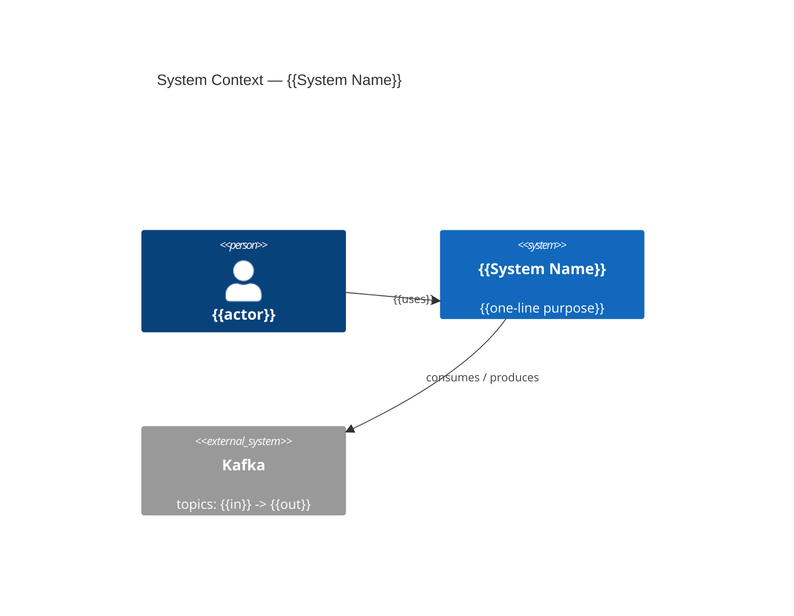
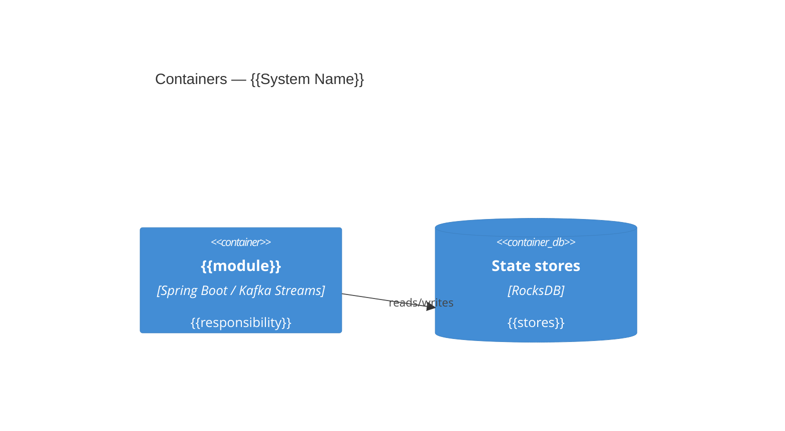
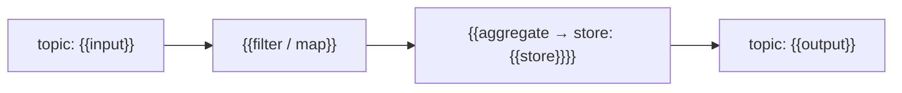

<!--
  DESIGN SPEC TEMPLATE — arc42 (tailored) + Kafka Topology Inventory + C4.
  Tags for the generating agent:
    SOURCE: evidence  -> fill from the evidence pack; cite file paths / counts.
    SOURCE: human     -> leave the "> ⚠️ HUMAN:" stub; do NOT guess.
  Delete these comments in the final document. Keep it lean: empty sections are fine (arc42 "cabinet" principle).
-->

# {{System Name}} — System Design

_Generated by `codebase-to-specs` on {{DATE}} from commit {{git sha}}. Complete architectural "as-is" baseline of the codebase._

> **Role:** this is the SDD baseline for a brownfield project. It must capture the **entire architecture** — every module, topology, topic, state store, integration, and data flow — correctly, because future enhancement specs are written against it. Scope = architecture and runtime behavior *as-is*; detailed per-feature behavioral specs are authored incrementally at the point of change, not here. **An engineer who knows the system must verify this doc before it is used as the base.**

## Executive Summary
<!-- SOURCE: synthesize from the rest of the doc — written for a human reader, not the agent. ~1 page. -->
A plain-language overview for humans: what the system does, its major components and how they fit together, the principal data flows through Kafka, the key technology choices, and the most significant risks or technical debt. A new engineer should grasp the shape of the system from this section alone.

## 1. Introduction & Goals
<!-- SOURCE: human -->
> ⚠️ HUMAN: What is this system for, and what are its top 3–5 quality goals (e.g., throughput, exactly-once correctness, latency)? The code can't tell us the *why*.

## 2. Constraints
<!-- SOURCE: evidence (technical) + human (business/org) -->
- Technical: {{language/runtime, build tool, messaging platform}} — see **AGENTS.md → Toolchain & Dependencies** for exact versions (not duplicated here).
> ⚠️ HUMAN: business / organizational constraints.

## 3. Context & Scope
<!-- SOURCE: evidence -->
External systems, input/output Kafka topics, REST/DB integrations the code talks to.

**C4 — System Context** (use Mermaid `C4Context`; fall back to a flowchart if the renderer lacks C4 support):

## 4. Solution Strategy
<!-- SOURCE: evidence + human -->
The handful of fundamental approaches visible in the code (streaming model, state strategy, serialization, error strategy). Keep to 4–6 bullets.

## 5. Building Block View
<!-- SOURCE: evidence -->
Modules → packages → key components (from the package layout + stereotypes).

**C4 — Container & Component** (one Component diagram per significant container):

## 6. Runtime View
<!-- SOURCE: evidence — REQUIRED: one data-flow diagram per topology. -->
Describe each topology's runtime path: source topic → operators → sink topic. Include a **data-flow diagram for every topology** (Mermaid `flowchart`), e.g.:

Every topology listed in the Topology Inventory must have a corresponding diagram here.

## 7. Deployment View
<!-- SOURCE: evidence (config/Docker/k8s if present) + human -->
> ⚠️ HUMAN: confirm runtime topology (instances, partitions, environments) if not derivable from config.

## 8. Crosscutting Concepts
<!-- SOURCE: evidence -->
Recurring patterns: serialization/serdes, error handling & DLQ, state management, configuration, logging, security (where detectable).

## 9. Architecture Decisions
<!-- SOURCE: evidence (inferred) + human (rationale) -->
Lightweight ADRs for the significant decisions visible in the code. Mark inferred rationale as such.
- **ADR-001 — {{decision}}**: Context / Decision / Consequences. `> ⚠️ HUMAN: confirm rationale.`

## 10. Quality Requirements
<!-- SOURCE: human -->
> ⚠️ HUMAN: quality scenarios (the measurable form of section 1's goals).

## 11. Risks & Technical Debt
<!-- SOURCE: evidence -->
Detected smells / anti-patterns from the evidence pack (e.g., blocking I/O in a processor, undocumented repartitions, field injection). Flag, don't fix.

## 12. Glossary
<!-- SOURCE: evidence + human -->
Domain and technical terms surfaced from the code.

---

## Topology Inventory
<!-- SOURCE: evidence — the highest-value, Kafka-specific section. One row per topology. -->

| Topology | Input topic(s) | Output topic(s) | Stateless ops | Stateful ops | State store(s) | Key / partitioning | Processing guarantee | Repartitions | Notes |
|---|---|---|---|---|---|---|---|---|---|
| {{name}} | {{in}} | {{out}} | {{map/filter/…}} | {{aggregate/join/windowed}} | {{store + type}} | {{key}} | {{at_least_once / exactly_once_v2}} | {{yes/no + where}} | {{evidence: file:line}} |

---

## Coverage Checklist (completeness gate — must be 100% before this baseline is "done")
<!-- SOURCE: cross-check against the COMPLETE inventory in evidence-pack.md. Every enumerated element must appear above. -->
Confirm every architecturally-significant element from `evidence-pack.md` is represented in this document:

- [ ] Every **module** in the build is described (Building Block View).
- [ ] Every **topology / processor class** has an inventory row **and** a data-flow diagram.
- [ ] Every **input/output topic** appears in a topology row.
- [ ] Every **state store** is listed with its owning topology and type.
- [ ] Every **external integration** (DB / REST / other clusters) appears in Context & Scope.
- [ ] Detected **anti-patterns** are recorded in Risks & Technical Debt.
- [ ] An engineer who knows the system has reviewed and corrected the above.

List any gaps here and resolve them. The document is not a valid SDD base until this checklist is complete.
