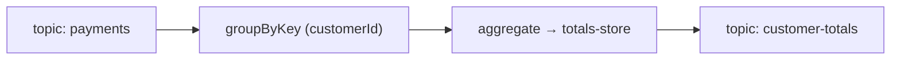

# System Design — Payments (illustrative)

The one canonical design. Features edit it on their branch; merging folds the change in.

## Executive Summary
A Kafka Streams service that maintains per-customer payment totals. Single topology, one keyed state
store, exactly-once. (Illustrative baseline for the example feature.)

## Topology Inventory
| Topology | Input | Output | Stateless | Stateful | State store | Key | Guarantee | Repartitions |
|---|---|---|---|---|---|---|---|---|
| customer-totals | payments | customer-totals | — | aggregate | totals-store (keyed) | customerId | exactly_once_v2 | none |

## Runtime view

## Crosscutting
Serdes: String key; Json(Payment) in, Json(Total) out — explicit at each boundary.

## Blue-green topology evolution
Store name and key unchanged across releases → state carries over; new instances rebuild from the
changelog. ⚠️ HUMAN: confirm no serde change before release.
