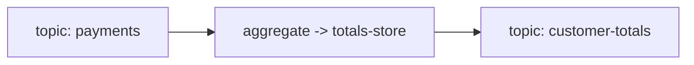

# Design: Customer Payment Totals (fixture)

| | |
|---|---|
| **Status** | Accepted |
| **Version** | 1.0 |

> Fixture design for the handoff eval — approved; the next step is planning. Deliberately small but
> complete enough that `/sdd-plan` can derive tasks + traceability from it ALONE (no chat history).

## 1. Introduction and Goals
Aggregate per-customer payment totals (R-1) and emit a running total on each payment (R-2).
Correctness: exactly-once (`exactly_once_v2`).

## 5. Building Block View

### Topology Inventory
| Topology | Input topic(s) | Output topic(s) | Stateless ops | Stateful ops | State store(s) | Key / partitioning | Guarantee | Repartitions |
|---|---|---|---|---|---|---|---|---|
| customer-totals | payments | customer-totals | (none) | aggregate | totals-store (KV, keyed) | customerId | exactly_once_v2 | no |

## 6. Runtime View  *(binding)*

### 6.1 **[INVARIANT]** Idempotent emit (R-2)
Every input payment produces exactly one output record with the updated total; replay does not double-count.

## 8. Cross-cutting Invariants & Contracts  *(binding)*
### 8.1 **[CONTRACT]** State store
`totals-store`: KV store keyed by `customerId`; value = running total; changelog-backed; `exactly_once_v2`.

## 10. Quality Requirements & Test Specifications
### 10.2 **[TEST]** Oracles
| Behaviour | Test |
|---|---|
| Aggregation (R-1) | `TopologyTestDriver`: feed payments for a customer -> assert stored total increases by the amount |
| Idempotent emit (R-2) | replay a payment -> assert exactly one output record, no double-count |
