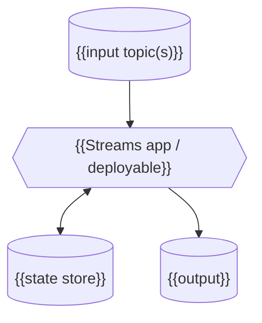
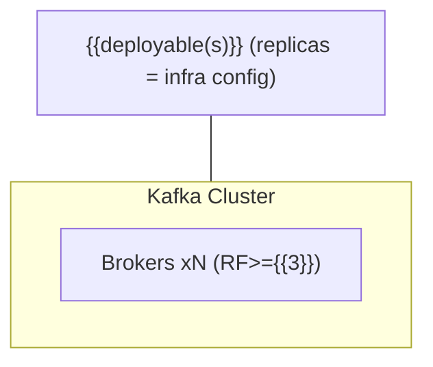

# Design: {{System Name}}

| | |
|---|---|
| **Status** | {{Draft / In review / Accepted}} |
| **Owner(s)** | {{accountable architect}} |
| **Version** | {{x.y}} |
| **Last updated** | {{ISO-8601}} |
| **Tech stack** | Kafka / Kafka Streams / {{...}} |
| **Intended readers** | Humans (orientation) / coding agents (binding contracts) |
| **Encoding** | ASCII-only by policy (this doc is parsed by agents; no smart quotes / unicode symbols) |

> The one canonical, whole-system design for this service. A feature edits it in place; decisions live in
> `docs/adr/`. Shard into `docs/design/` only when it grows large. Greenfield: author from requirements.
> Brownfield: generated by `sdd-codebase-to-design` and human-verified before use.

---

## How to read this doc

Two layers:
- **Orientation (S1-5, 7, 10-12)** - context, shape, goals. Read for *what* and *why*. **Not normative** for code.
- **Binding (S6, 8, 9)** - contracts, invariants, decisions the implementation MUST honour. An agent treats these as the spec.

**Binding markers** - every normative statement carries one; scan for them:
- **[CONTRACT]** - a fixed interface/schema/spec. Implement exactly; do NOT invent shape.
- **[INVARIANT]** - a property that must always hold. Violating it is a silent correctness bug.
- **[ADR]** - a deliberate decision. Do NOT optimise it away without superseding the ADR.
- **[TEST]** - an executable oracle that pins the behaviour above it.

Everything unmarked (including illustrative pseudocode) is the implementer's to fill.

---

## 1. Introduction and Goals

### 1.1 Requirements overview
{{Plain-language overview: what the system does, principal Kafka data flows, what it must never do. A new
engineer should grasp the shape from this section alone. Trace to requirement IDs (R-x) where they exist.}}

### 1.2 Quality goals (ranked - ties break by this order)
| # | Goal | Measure |
|---|---|---|
| 1 | {{e.g. no loss / no duplicates / no regression}} | {{the measurable contract}} |
| 2 | {{correctness property}} | {{measure}} |
| 3 | {{latency / throughput}} | {{p99 number}} |

### 1.3 Stakeholders
{{Consumers (correctness) | Operations (recoverability, lag) | upstream/source owners (contracts)}}

---

## 2. Architecture Constraints
- {{Mandated tech / platform constraints.}}
- Scale (given): {{TPS, payload size, fan-out, skew assumptions}}.
- **Delivery semantics: {{at-least-once / exactly_once_v2}} (DECIDED).** {{Why; what correctness rests on.}}

---

## 3. System Scope and Context
```mermaid
flowchart LR
  SRC["{{source(s)}}"] -->|{{events}}| SYS["**{{System}}**"] -->|{{output}}| SINK["{{sink}}"]
```
**Correlation / keying semantics.** {{What identifies a record; the effective join/partition key.}}

**Cardinality (state if non-trivial).** {{1:1 vs N:1 vs N:M between the joined entities - this dictates the
keying of stores and work queues; getting it wrong is a silent data-loss class.}}

| Interface | Direction | Topic/store | Key | Notes |
|---|---|---|---|---|
| {{name}} | in/out | {{topic}} | {{key}} | {{provenance / format}} |

---

## 4. Solution Strategy
> {{The one decision everything follows from - one sentence.}}

- {{key choice}} -> **ADR-00x**
- {{key choice}} -> **ADR-00x**

> **Open-item gate.** The spine MUST NOT stay conditional on unmeasured quantities. Resolve load-bearing
> open items with a default here (each may keep a telemetry-driven *review* trigger); list the rest in S11.

---

## 5. Building Block View
> Hierarchical (arc42): **5.1** is the Level-1 whitebox (system as containers); **5.2** zooms into the
> blocks complex/risky enough to warrant it. Standard infrastructure stays a black box. Behaviour -> S6;
> contracts -> S8/S9 (link, don't repeat).

### 5.1 Whitebox: overall system (Level 1)


#### Topology Inventory (mandatory - one row per topology)
| Topology | Input topic(s) | Output topic(s) | Stateless ops | Stateful ops | State store(s) | Key / partitioning | Guarantee | Repartitions |
|---|---|---|---|---|---|---|---|---|
| {{name}} | {{in}} | {{out}} | {{map/filter}} | {{aggregate/join}} | {{store+type}} | {{key}} | {{guarantee}} | {{yes/no + where}} |

| Container | Responsibility | Deployable | Stateful? |
|---|---|---|---|
| {{component}} | {{responsibility}} | {{1/2/infra}} | {{yes/no}} |

> **Deployable boundaries.** {{How many deployables and why; which owns state; consumer-group / offset
> boundaries; whether any component performs external side effects.}}

### 5.2 Level 2 (zoom into the complex/risky blocks only)
{{For each refined block: a whitebox diagram + a component table mapping each part to its S6/S8/S9 contract.
Name the key internal contract (e.g. the store-marker state machine).}}

---

## 6. Runtime View  *(binding)*

### 6.1 End-to-end flow (at a glance)
{{Ingest -> key/normalize -> the core operation -> branch on success/miss -> finalise. One bullet per stage.}}

### 6.2 Scenario: {{happy path}}
{{Narrate, then a `sequenceDiagram`. Cover the order-independent / common case.}}

### 6.x Scenario: {{failure / retry / late-data path}}
{{The paths that are easy to get subtly wrong - retries, give-up, crash-replay, out-of-order. Diagram each.}}

### 6.y **[CONTRACT]** {{the one or two operations easy to get subtly wrong}}
{{Trimmed pseudocode for the load-bearing logic only (e.g. join-back, give-up rule). Mark it [CONTRACT].}}

---

## 7. Deployment View

### 7.1 Deployment parameters (informational - NOT code)
> Sizing choices for provisioning, not contracts the app encodes. The app MUST NOT hardcode partition,
> thread, standby, or replica counts - they are externalized config (S8.8). State the value-agnostic,
> code-relevant rule here and point to its binding home (e.g. co-partition equality, S8.2).

---

## 8. Cross-cutting Invariants & Contracts  *(binding)*

### 8.1 **[INVARIANT]** Delivery, idempotency, {{monotonicity}}
{{The properties that together give no-loss / no-dup / no-regression. State each and why removing it breaks.}}

### 8.2 **[INVARIANT] + [CONTRACT]** Keying / co-partitioning
{{Equal partition count is necessary but not sufficient: pin the canonical key form (bytes), the partitioner,
and that external producers honour both. State that partition count P and key form are immutable without a
reprocess (the startup equality assertion does NOT catch a coordinated P bump).}}

### 8.3 **[CONTRACT]** State store(s) + marker/state-machine
| Field | Spec |
|---|---|
| Key | {{key}} |
| Value | {{thin value}} |
| Backing | {{compacted changelog; value serde -> S8.x}} |
| Retention | {{TTL and what it is sized to}} |
| Standby | {{num.standby.replicas}} |

{{If the store encodes a state machine, enumerate the states and transitions explicitly - it is a contract.}}

### 8.4 **[CONTRACT]** Sink / output collection(s) + writer seam
{{Output key; idempotent + monotonic write rule (a write applies only if its rank >= stored rank); a single
writer seam so the guard has one implementation.}}

### 8.5 **[INVARIANT]** Retry / reconciliation paths
{{Each retry path: substrate, SLA, give-up rule (age- vs count-authoritative), and that paths with different
time-scales MUST NOT be merged. Cleanup ownership; whether duplicates are tolerated-and-absorbed vs prevented.}}

### 8.6 **[CONTRACT]** Serialization & schema
- **Format:** {{Avro + Schema Registry / ...}}; per-topic subjects.
- **Compatibility:** {{BACKWARD minimum}} - enables rolling upgrades. **Changelog value serde stays
  compatible**, or the store corrupts on the next deploy.
- **Keys:** {{canonical form / serde}}.

### 8.7 **[CONTRACT]** Error handling / poison messages
{{"Never dropped" includes malformed input: route to a quarantine DLQ with reason + coordinates, and alert.}}

### 8.8 Configuration (encodes the decisions above)
| Property | Value | Encodes |
|---|---|---|
| `processing.guarantee` | {{...}} | S2 / S8.1 |
| state store retention | {{...}} | S8.3 |
| topic partition count | externalized; equal across co-partitioned topics | S8.2 |
| {{tunable}} | {{value (tunable)}} | {{ref}} |

### 8.9 Cross-release / blue-green evolution
{{Mandatory (design-standard rubric). State the code-relevant rules: serde compatibility across releases,
key/store-name/partition-count immutability (reprocess vs rolling), and how the monotonic sink protects rows
during overlap. The operational runbook (choreography) may live in `RELEASE.md`; the code-relevant rules
stay here.}}

### 8.10 Observability, SLOs & security
| Signal | Metric | Alert / SLO |
|---|---|---|
| {{lag / breaker / quarantine / deferral / version skew}} | {{metric}} | {{threshold tied to a quality goal}} |

Security: {{auth to brokers, ACLs, encryption at rest, projection limits, PII handling}}.

---

## 9. Architecture Decisions  *(binding - do not supersede silently)*  **[ADR]**

| ADR | Decision | Status |
|---|---|---|
| 00x | {{decision}} | Accepted |

Full records for the load-bearing decisions (also mirrored to `docs/adr/`):
```markdown
# ADR-00x: {{title}}
- Status: Accepted | Date: {{ISO-8601}}
## Context
{{forces}}
## Options
1. {{...}}  2. {{...}}
## Decision
{{what and why}}
## Consequences
+ {{benefit}}  - {{cost}}
{{Review trigger: if <telemetry> shows <condition>, re-evaluate.}}
```

**[CONTRACT]** {{Any code seam mandated here, e.g. a repository / writer interface - no driver types in the
signature.}}

---

## 10. Quality Requirements & Test Specifications

### 10.1 SLAs
{{throughput | payload | latency p99 | late horizon | zero loss/dup/regression}}.

### 10.2 **[TEST]** Unit / topology oracles
| Behaviour | Test |
|---|---|
| Topology / ordering | `TopologyTestDriver`: feed both arrival orders -> assert emission |
| {{each [INVARIANT]/[CONTRACT] above}} | {{the oracle that pins it}} |

### 10.3 **[TEST]** System / integration oracles
| Path | Oracle |
|---|---|
| End-to-end | {{ingest -> output, assert single correct row}} |
| {{retry / reconcile / crash-replay}} | {{oracle}} |

---

## 11. Risks & Open Items
| ID | Item | Status | Owner / date |
|---|---|---|---|
| O-x | {{item}} | {{Open / Resolved: <default>}} | {{owner}} / {{date}} |

---

## 12. Glossary
| Term | Meaning |
|---|---|
| {{term}} | {{meaning}} |

---

### Mapping to in-repo artifacts
S9 ADR blocks -> `docs/adr/ADR-0NN-*.md`; S8 contracts -> schemas + a topic manifest; S9 seams -> the named
interfaces; S10 -> the test suite.
